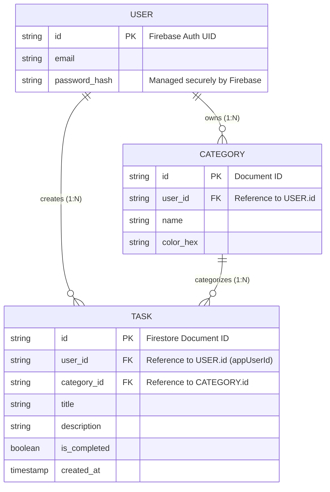

### 3. Data Structure (Entity-Relationship Diagram)

Este diagrama ilustra la estructura de datos Cloud-Native. En el contexto de Firestore:

* Las **Entidades (Entities)** representan Colecciones (`Collections`).
* Las **Filas (Rows)** representan Documentos (`Documents`).
* Las **Relaciones (Relationships)** se mantienen mediante el almacenamiento del ID del documento padre como un atributo de tipo *String* en el documento hijo (ej. `user_id`).

#### Notas Técnicas sobre la Estructura de Datos (NoSQL)

* **Aislamiento de Datos (Data Isolation):** El atributo `user_id` en la colección `TASK` es el pilar de las reglas de seguridad. Es el campo que Firestore utiliza, a través de los índices compuestos, para garantizar que cada dispositivo descargue y modifique única y exclusivamente la información que le pertenece.
* **Flexibilidad (Schema-less):** Dado que Firestore no impone esquemas estrictos, los campos nulos (como una `description` vacía) simplemente no se guardan en el documento JSON, optimizando el ancho de banda y el almacenamiento en la nube.
